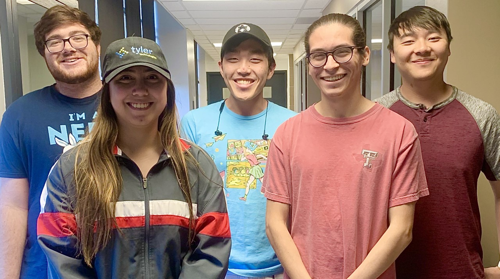

# P2.9

## About the game
This is an obstacle dodging game. 
The player will control a player model using machine learning with camera functionality to dodge incoming obstacles that progressively get faster the longer the game is played. The controls will be camera operated where the user will take pictures of what they will do to go left and pictures of what they will do to go rght for the machine learning aspect of the project. The goal is to go as far as possible without hitting an obstacle, or they will restart from the beginning. (This game is meant to be frustrating with the ultimate satifacation of finishing the game without hitting a single obstacle.) 

## About our team
<input group picture here>

From right to left: Timothy Bell, Angela Green, Stanley Yoang, Abraham Esparza, and Jack Chen

Angela Green - Team Leader. Update the README file. Keep everyone on task, make sure we're hitting benchmarks. Help where needed. Keeping everyone updated and distributed the tasks. Making sure everyone has what they need to accomplish their tasks. Research UI for the start menu screen, the control setup screen, and the game's overall look while applying the design principles talked about in class. 

Timothy Bell - Research and utilize Unity to create the functionality of the game (moving an object left and right per user input). Research machine learning and implement it to apply to our game (taking pictures for the controls, storing them, understand how it works, etc.).

Stanley Yoang - Sketch the ideas that we all come up with. Make sure the UI/UX in the sketch will be similar to how it will be implemented. Implementing the menu design from the sketches and making sure that the product looks how we planned it during the beginning phase. Researching Unity and help create assets that are needed in the game.

Abraham Esparza - Research and utilize the machine learning that we learned from class under the project 1 resources. Implementing the capture of the user's camera, and be able to take a picture for the machine learning process.

Jack Chen - Research and utilize the machine learning that we learned from class under the project 1 resources. Implement the functionality of the machine learning process, in inputting a picture taken from Abraham to be utilized in the controls of moving the player model to the left or right. 

## Our sketches 

Current Condition:  
-User has started and loaded the game

Action:  
-User presses start button

New Conditions:  
-Games shows controls menu and how to set up game to work properly  
-User is able to click on take picture button to teach the game how to move

Action:  
-User presses play button

New Conditions:  
-Game displays rules and countdown until the game starts  
-User can see him/herself in camera at the bottom of screen

Action:  
-Timer runs down so the game has started  
-User tilts head towards the left

New Conditions:  
-Player model moves to the left

Action:  
-User tilts head towards the right

New Conditions:  
-Player model moves to the right

## What we've done
Started researching everything we need, played around with Unity individually to get familiar with the interface. Independently planned out what needs to be done to accomplish our designated tasks.

## Plan moving forward
Create the Unity game file, and create clones on everyone's computers. Focus on the distributed tasks, and get those accomplished. If we run into road blocks, we'll ask each other to knowledge share and overcome everything together.
